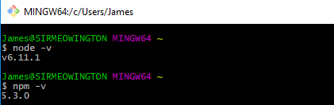

# How to: Setup a React development environment on Windows

Guide to installing the tools required to run React+Webpack (via create-react-app) on Windows

> **Attention! Before getting started!** This guide was tested on Windows 10 using Node v6.11.1 and npm 5.3.0. Optionally, we highly recommend installing Git Bash for Windows. When you install both Node.js and Git bash, make sure that the _default_ options to add both to your *PATH* are checked off.

## Steps

1. Installing Node.js v6.11.1
2. Running the Node.js Command Prompt
3. Upgrading **npm**
4. Installing **create-react-app**
5. Creating a basic React application
6. Starting your React application
7. Editing your React application
8. Releasing your React application to the public

#### 1. Installing Node.js

> Please install Node v6.11.10. [Here is a direct link to the installer](https://nodejs.org/en/download/). It is labelled under **LTS** and _not_ **Current Release**.

First, you'll need to download and install the Node.js client. You should also [download the Git Bash for Windows](https://git-scm.com/download/win) client, too. This will enable you to use Node.js inside of a unix-friendly terminal environment so your linux and Mac friends can help you. 

#### 2. Running the Node.js Command Prompt

Once you've installed both, open the **Git Bash** application that was installed. We recommend adding this to your task bar. Now, let's verify everything installed correctly. Don't worry about the `$` at the start of each line; that is just letting you know you that the command line is able to accept input. Here is what your bash terminal will look like when you complete this step:



In your terminal, type in:

```bash
node -v
```

You should see output similar to:

```bash
$ node -v
v.6.11.1
```

This verifies that we have Node.js version 6.11.1 installed on our computer. Next, type in:

```bash
npm -v
```

This verifies that the _node package manager_ (npm) has been installed. You should see output similar to:

```bash
$ npm -v
3.6.8
```


