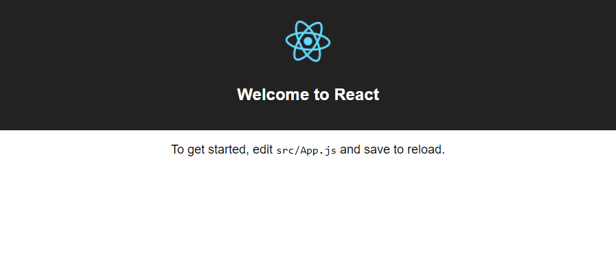

# How to: Setup a React development environment on Windows

Guide to installing the tools required to run React+Webpack (via create-react-app) on Windows

> **Attention! Before getting started!** This guide was tested on Windows 10 using Node v6.11.1 and npm 5.3.0. Optionally, we highly recommend installing Git Bash for Windows. When you install both Node.js and Git bash, make sure that the _default_ options to add both to your *PATH* are checked off.

## Steps

1. Installing Node.js v6.11.1
2. Running the Node.js Command Prompt
3. Upgrading **npm**
4. Installing **create-react-app**
5. Creating a basic React application
6. Starting your React application
7. Editing your React application
8. Releasing your React application to the public

#### 1. Installing Node.js

> Please install Node v6.11.10. [Here is a direct link to the installer](https://nodejs.org/en/download/). It is labelled under **LTS** and _not_ **Current Release**.

First, you'll need to download and install the Node.js client. You should also [download the Git Bash for Windows](https://git-scm.com/download/win) client, too. This will enable you to use Node.js inside of a unix-friendly terminal environment so your linux and Mac friends can help you. 

#### 2. Running the Node.js Command Prompt

Once you've installed both, open the **Git Bash** application that was installed. We recommend adding this to your task bar. Now, let's verify everything installed correctly. Don't worry about the `$` at the start of each line; that is just letting you know you that the command line is able to accept input. Here is what your bash terminal will look like when you complete this step:


In your terminal, type in:

```bash
node -v
```

You should see output similar to:

```bash
$ node -v
v.6.11.1
```

This verifies that we have Node.js version 6.11.1 installed on our computer. Next, type in:

```bash
npm -v
```

This verifies that the _node package manager_ (npm) has been installed. You should see output similar to:

```bash
$ npm -v
3.6.8
```

#### 3. Upgrading npm

We want to make sure that the _node package manager_ (npm) is up to date. Run the following terminal command:

```bash
npm i -g npm@latest
```

In english, we are telling the computer the following: _node package manager: (i)nstall (-g)lobally on my computer [so it can be used anywhere] the latest version of npm [yourself].

This could take a few moments to run. Once it is complete, you'll see output similar to the following (but it may not match exactly.. each computer is different):

```
npm i -g npm@latest
C:\Users\James\AppData\Roaming\npm\npx -> C:\Users\James\AppData\Roaming\npm\node_modules\npm\bin\npx-cli.js
C:\Users\James\AppData\Roaming\npm\npm -> C:\Users\James\AppData\Roaming\npm\node_modules\npm\bin\npm-cli.js
+ npm@5.3.0
updated 1 package in 25.406s
```

#### 4. Installing create-react-app

There is a boilerplate already written for react - it is called _create-react-app_. It is available, like many other scripts, on the _node package manager (npm)_. We can install it using the `npm i` command again. Run the following code in your terminal:

```bash
npm i -g create-react-app
```

This can also take a few moments - `npm` is having to install React and other tools on your computer. Once complete, you'll see output similar to this:

```bash
$ npm install create-react-app -g
C:\Users\James\AppData\Roaming\npm\create-react-app -> C:\Users\James\AppData\Roaming\npm\node_modules\create-react-app\index.js
+ create-react-app@1.3.3
updated 1 package in 41.553s
```

## 5. Creating a basic React application

> You're over halfway there! Keep it up!

It is time for you to finally create a React application from the `create-react-app` boilerplate. When you use `create-react-app`, you should specfiy a name for your application. It will create the following file structure for you in a folder with the name of your app. That structure looks like this:

```bash
├── README.md
├── package.json
├── public
│   ├── favicon.ico
│   └── index.html
└── src
    ├── App.css
    ├── App.js
    ├── App.test.js
    ├── index.css
    ├── index.js
    └── logo.svg
```

The `index.html` has all of the App.js code _injected_ into it using the tools that `create-react-app` provides. It even creates start Javascript and CSS files for you. **This should make you feel awesome!**

Time for you to try it out. Run:

```bash
create-react-app hi-react
```

This creates a folder wherever you are called `hi-react`. _create-react-app_ tells you where this is installed so you can easily find it to open in your text editor. Once complete, you should see the following (or similar):

```bash
$ create-react-app hi-react
Creating a new React app in C:\Users\James\hi-react.

Installing packages. This might take a couple of minutes.
Installing react, react-dom, and react-scripts...

+ react@15.6.1
+ react-dom@15.6.1
+ react-scripts@1.0.10
added 1205 packages in 54.568s

Success! Created hi-react at C:\Users\James\hi-react
Inside that directory, you can run several commands:

  npm start
    Starts the development server.

  npm run build
    Bundles the app into static files for production.

  npm test
    Starts the test runner.

  npm run eject
    Removes this tool and copies build dependencies, configuration files
    and scripts into the app directory. If you do this, you can’t go back!

We suggest that you begin by typing:

  cd hi-react
  npm start
```

#### 6. Starting your React application

_create-react-app_ includes a web server to test your app on. You'll need to _change directory_ (cd) into your applicaton to run it. Do this:

```bash
cd hi-react
```

And then run:

```bash
pwd
```

You should see that you your `hi-react` folder:

```bash
$ pwd
/c/Users/James/hi-react
```

Now, start your application using `npm` --

```bash
npm run start
```

You'll be informed that your application is running. It _should_ also open up a new web browser pointing to the correct (but temporary) URL.

```bash
$ npm run start

> hi-react@0.1.0 start C:\Users\James\hi-react
> react-scripts start

Starting the development server...

Compiled successfully!

You can now view hi-react in the browser.

  Local:            http://localhost:3000/
  On Your Network:  http://192.168.56.1:3000/

Note that the development build is not optimized.
To create a production build, use npm run build.
```

You can also browse tothe _local_ address provided. In this case, you could point your browser to [http://localhost:3000/](http://localhost:3000/)

You should see the React starter page.



#### 7. Editing your React application
#### 8. Releasing your React application to the public
